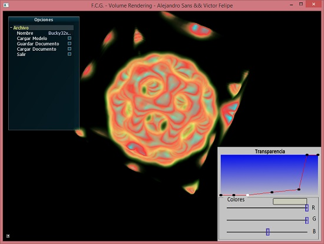
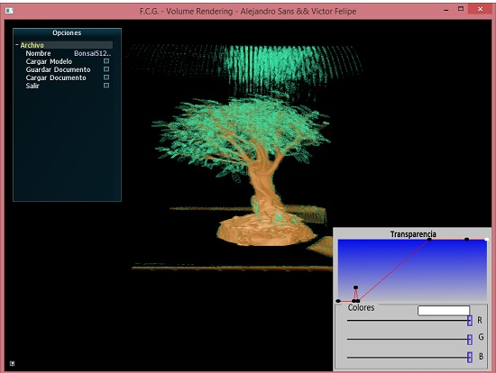

# Volume Rendering
This is a project created by Alejandro Sans (sansalejandro@gmail.com) and Víctor Felipe for a Computer Graphic course (Universidad Central de Venezuela). 

This project show the technique displaying Volume Rendering with texture 2D. It has a transparency function that allows to hide and show the slice of the volume.

To load a volume, the file must be on the folder "files/Modelos". It should be a .raw file and the number of slices in each axis must be separated by an "x", as shown as follow:

- files/Modelos/Bonsai512x512x182.raw

# Compiling

This project requires compiling with visual studio 2015 and the following external libraries:

* [FreeGLUT] 3.0.0-2
* [AntTweakBar] 1.16
* [FreeImage] 3.17.0
* [GLEW] 2.0.0

To compile in visual studio, the header files must be on a "tools" folder that must be created in the root folder. The headers should be included as follow:

    - tools/GL (FreeGlut and GLEW)
    - tools/AntTweakBar (AntTweakBar)
    - tools/FreeImage (FreeImage)

The libraries must be on a folder "lib" that must be created in the root as follow:
- lib

And the dll should be include on the folder "Tarea 1",

# Images

Here are some images of the application with 2 different volumes:

   [video]: <https://vimeo.com/37664294>
   [SDL]: <https://www.libsdl.org/>
   [SDL_mixer]: <https://www.libsdl.org/projects/SDL_mixer/>
   [FreeGLUT]: <http://freeglut.sourceforge.net/>
   [FreeImage]: <http://freeimage.sourceforge.net/>
   [AntTweakBar]: <http://anttweakbar.sourceforge.net/doc/>
   [GLEW]: <http://glew.sourceforge.net/>
